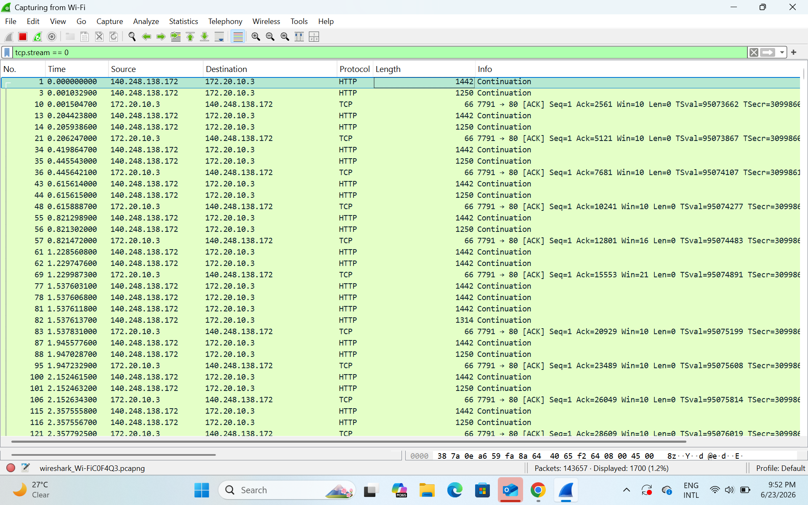
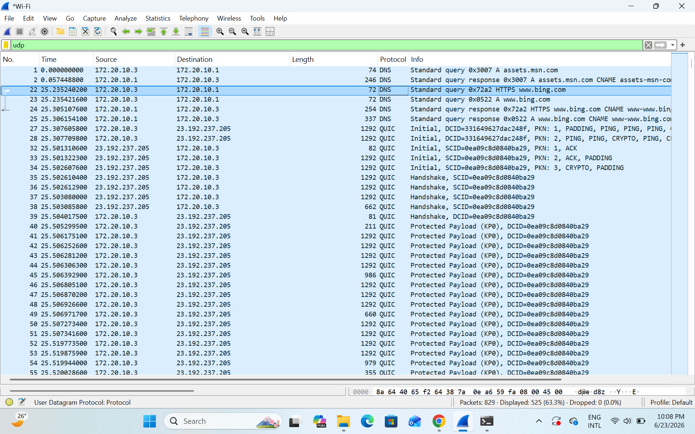
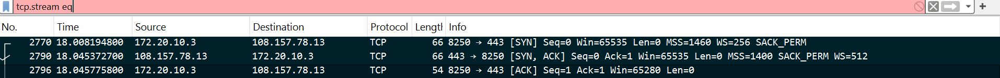

# TCP vs UDP Traffic Analysis Lab

## Objective
For this lab I wanted to actually see the difference between TCP and UDP instead of just reading about it. So I opened Wireshark, captured some live traffic from my own machine, and looked at how each protocol behaves.

## Tools Used
- Wireshark
- My laptop (connected to Wi-Fi)
- Chrome browser to generate traffic
- Command line (`nslookup`) to trigger DNS lookups

## Procedure
1. Opened Wireshark and picked my Wi-Fi interface.
2. Hit start to begin capturing.
3. For TCP, I visited a plain HTTP site (not HTTPS) so the traffic wouldn't be encrypted and I could actually read it in Wireshark.
4. For UDP, I ran some DNS lookups and also just let normal browsing happen in the background, since a lot of sites use QUIC now.
5. Filtered the capture different ways depending on what I wanted to look at (`tcp.stream`, `udp`, `tcp.flags.syn == 1`).
6. Took a screenshot for each part of the lab.
7. Stopped the capture and wrote down what I noticed.

## TCP Analysis
Filter used: `tcp.stream == 0`

I filtered down to just one TCP conversation instead of the whole `tcp` filter, because that made it way easier to actually read what was happening instead of scrolling through everything. What I saw was a back-and-forth between my machine (172.20.10.3) and a server (140.248.138.172) over port 80 (HTTP).

A lot of the packets show up as **HTTP : Continuation**. At first I thought something was wrong, but that's actually normal  it just means the data being sent was too big to fit in one packet, so it got broken into multiple TCP segments. After each chunk, my machine sends back a TCP **[ACK]** confirming it got that piece, and the Ack number keeps increasing each time (2561, 5121, 7681, 10241...). That's the part that actually shows TCP doing its job making sure every piece of data is accounted for and arrives in order.

## UDP Analysis
Filter used: `udp`

For UDP I expected to mostly see DNS, and I did.There's a clean example near the top where my machine asks for `assets.msn.com` and gets a response back right away, no handshake involved, just a request and a reply.

But scrolling further down I also saw a bunch of **QUIC** traffic. I didn't expect this at first, but QUIC is actually built on top of UDP.it's used by a lot of sites now (Bing in my capture) instead of regular TCP+TLS, mainly because it's faster. So my UDP capture actually shows two different things: simple DNS lookups, and QUIC, which is a more modern protocol still using UDP underneath. Neither one has a handshake the way TCP does QUIC has its own setup process (Initial/Handshake packets) but it's still way different from TCP's three-way handshake.

## TCP Handshake
Filter used: `tcp.stream eq` (selecting one stream to isolate the handshake packets)

This shows the three-way handshake clearly:
- Packet 2770: my machine sends **[SYN]** to 108.157.78.13 on port 443
- Packet 2790: the server replies with **[SYN, ACK]**
- Packet 2796: my machine sends the final **[ACK]**

This is the part that actually proves TCP sets up a connection before sending any real data, unlike UDP which just sends straight away.

## Comparison Table

| Feature | TCP | UDP |
|---|---|---|
| Connection | Has to set up a connection first (handshake) | Just sends, no setup |
| Reliable? | Yes | No |
| Acknowledgements | Yes (saw ACK numbers increasing) | No |
| Handshake | Yes (SYN, SYN-ACK, ACK) | No |
| Speed | Slower (more overhead) | Faster |
| Retransmits lost data | Yes | No |
| Keeps order | Yes | No |
| What I actually saw | Handshake + HTTP data split into continuation segments | DNS query/response, and QUIC traffic |

## Conclusion
Doing this hands-on made the difference between TCP and UDP a lot clearer than just reading definitions. With TCP I could literally watch the handshake happen before any data moved, and then see the data get broken into segments with acknowledgements confirming each one arrived. With UDP there was none of that  DNS just sent a question and got an answer back immediately, and even QUIC, which is more complex than basic DNS, still doesn't bother with TCP's handshake process. It makes sense now why TCP gets used when you need everything to arrive correctly (loading a full webpage), and why UDP/QUIC gets used when speed matters more, since skipping all that setup and confirmation saves time.

